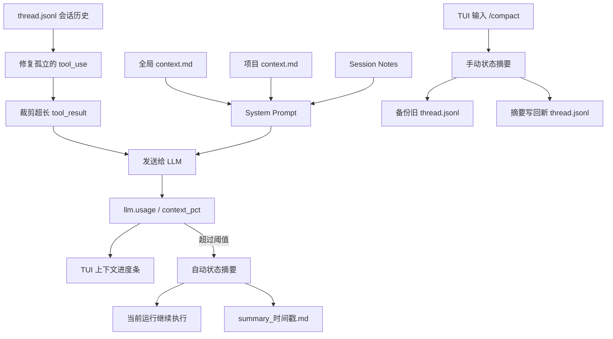

# 从“完整回放”到“带着状态继续”：FloRaClaude stage/s6 的上下文压缩实践

> 当一个 AI Agent 真正开始执行长任务，最先遇到的瓶颈往往不是工具数量，而是越来越长的上下文。FloRaClaude 在 `stage/s6` 中加入了上下文占用观测、工具结果裁剪、会话状态摘要、手动与自动压缩，以及全局/项目级上下文加载，让长会话从“不断累积历史”转向“保留关键状态继续工作”。

## s5 留下的问题：会话能延续，但成本也会延续

在 `stage/s5` 中，FloRaClaude 已经具备会话持久化能力。用户的消息、模型回复、工具调用和工具结果都会写入 `thread.jsonl`；下一次运行开始时，系统重新读取整段历史并交给模型。

这保证了连续性，却也带来了一个很现实的问题：历史只增不减。

对于普通聊天，这种增长可能并不明显；但 Agent 会频繁读取文件、执行命令、接收日志。一段数万字符的命令输出，往往只在当时有用，却会在后续每一次模型请求中被重复携带。随着任务推进，输入 token 持续上涨，最终会带来三类影响：

- 请求成本与响应延迟增加；
- 重要目标被大量早期细节稀释；
- 上下文接近模型窗口上限后，长任务无法继续。

因此，`stage/s6` 的重点不是简单删除旧消息，而是建立一套上下文生命周期管理机制：大块原始输出先裁剪，阶段性历史再压缩成状态摘要，真正需要长期生效的规则则进入独立的上下文文件。

从代码规模看，这次迭代包含 3 个提交，涉及 24 个文件，新增约 900 行代码。核心链路可以概括为：



## 第一层：先处理最“占地方”的工具结果

Agent 上下文中最容易膨胀的内容通常不是对话，而是 `tool_result`。例如一次递归目录扫描或测试日志，可能产生数万字符，但后续步骤往往只需要知道开头的关键信息和执行结论。

`stage/s6` 新增了 `truncate_tool_results()`：读取会话历史时，如果某个字符串类型的 `tool_result` 超过 8,000 字符，就只保留前 4,000 字符，并追加省略提示：

```text
[... 6000 chars omitted. Full output in run events.]
```

这里有两个值得注意的设计选择。

首先，裁剪只针对用户消息中的 `tool_result` block，不会误伤普通文本或 assistant 消息；同一条消息里包含多个工具结果时，每个 block 也会独立判断。

其次，处理发生在历史读取阶段，磁盘中的原始 `thread.jsonl` 不会被这一步覆盖，完整工具输出仍可从运行事件中追溯。换句话说，它减少的是下一次模型调用的上下文负担，而不是直接销毁运行证据。

## 第二层：把历史对话压缩成“可接班”的状态

仅仅截断日志还不够。长任务中会积累大量已经完成的讨论、尝试和决策，逐条保留它们的价值越来越低。为此，s6 引入了 `Compactor`，让模型把完整历史重新整理成一份结构化交接摘要。

摘要固定包含六个部分：

1. 原始目标；
2. 已完成步骤；
3. 关键约束与发现；
4. 当前文件状态；
5. 剩余待办；
6. 后续必须原样保留的关键数据。

这个结构很像工程团队的 handoff 文档。它不追求复述聊天，而是回答另一个模型实例接手任务时真正关心的问题：目标是什么、已经改了什么、哪些结论不能丢、接下来做什么。

压缩请求不会携带工具 schema，并使用独立的静默事件总线，避免摘要过程产生的 token 流混入当前会话 UI。摘要成功后，运行中的消息被替换成一组合法的对话边界：

```python
[
    {"role": "user", "content": summary_text},
    {
        "role": "assistant",
        "content": "Understood, I'll continue from this summary.",
    },
]
```

这样，下一次模型调用看到的不再是冗长历史，而是一份明确的任务状态和一条确认回复。

如果摘要调用抛出异常或返回空文本，压缩器会直接放弃操作，原消息列表保持不变。这条“失败不破坏上下文”的原则非常重要：压缩是一种优化，不能反过来成为任务失败的原因。

## 两种入口：手动压缩与自动压缩

s6 同时提供了手动和自动两条路径。

### 手动压缩：由用户决定阶段边界

当 TUI 空闲时，输入：

```text
/compact
```

客户端会调用新增的 `session.compact` 命令。服务端先获取对应 session 的锁，防止压缩与消息处理同时修改会话；摘要成功后，原 `thread.jsonl` 会被重命名为：

```text
thread_YYYYMMDD_HHMMSS.jsonl.bak
```

随后，新的 `thread.jsonl` 只保留“摘要 + assistant 确认”两条消息。TUI 会显示摘要 token 数和估算节省量。

手动模式非常适合存在明显阶段边界的任务，例如“调研已经结束，准备开始实现”或“后端改造完成，接下来处理前端”。用户比系统更清楚什么时候旧细节已经失去价值，因此 s6 默认更推荐这种方式。

### 自动压缩：根据上下文占用率触发

LLM Provider 现在会根据本次请求的 `input_tokens` 和模型上下文窗口计算：

```text
context_pct = input_tokens / context_window
```

然后通过 `llm.usage` 事件把 `context_pct` 传给 Agent Loop 与 TUI。当满足以下条件时，系统会触发自动压缩：

- 当前 run 尚未结束；
- 本轮模型请求了工具，并且工具结果已经追加完成；
- Provider 返回了 usage 信息；
- `context_pct` 达到配置阈值；
- 自动压缩没有被禁用。

把触发点放在工具结果写入之后很关键：此时消息序列以 user 侧的 `tool_result` 结束，压缩完成后又会形成新的 user/assistant 消息对，下一次 LLM 请求仍然满足消息协议要求。

自动压缩默认关闭，可以在 `~/.flora/config.toml` 中启用：

```toml
[compaction]
auto_threshold = 0.80
```

也可以使用环境变量：

```bash
FLORA_COMPACT_THRESHOLD=0.80
```

自动压缩成功后，当前运行会直接基于摘要继续，session 目录中同时生成 `summary_YYYYMMDD_HHMMSS.md`，并发布 `context.compacted` 事件，记录压缩前的估算 token 数和摘要 token 数。

## 不再“凭感觉”：上下文占用变得可观测

过去用户只能看到输入、输出和缓存 token，很难判断距离上下文上限还有多远。s6 在 `LlmUsageEvent` 中新增 `context_pct`，并在 TUI 中显示 20 格进度条：

- 低于 70%：灰色；
- 70% 至 85%：黄色；
- 85% 及以上：红色。

这项能力看似只是 UI 增强，实际上为手动压缩提供了决策依据，也为自动压缩提供了统一信号。上下文从一个隐藏资源，变成了可以观测和治理的运行指标。

当前代码为 `deepseek-v4-flash` 和 `deepseek-v4-pro` 配置了 200,000 token 的上下文窗口，未知模型暂时也按 200,000 token 兜底计算。

## 把稳定规则移出聊天：三级上下文注入

压缩会丢弃低价值细节，因此不能把所有长期规则都寄托在聊天记录里。s6 同时增加了三级上下文加载：

```text
基础 System Prompt
  + ~/.flora/context.md     # 全局上下文
  + ./.flora/context.md     # 项目上下文
  + session notes.md        # 会话笔记
```

三层内容按“全局 → 项目 → 会话”的顺序注入 System Prompt。文件不存在或只有空白时会被安全忽略。

这个变化与压缩机制是互补的：稳定的用户偏好、项目规范和持久事实不再依赖历史对话幸存下来；会话摘要只需要描述当前任务状态。仓库中的 `.flora/context.md` 就给出了一个简单示例，要求 Agent 把新文件创建在 `./workspace` 下。

## 长任务可靠性的另一块拼图：流式请求自动重试

长会话不仅容易触及 token 上限，也更容易遇到持续连接中断。s6 为 Anthropic 兼容 Provider 增加了流式请求重试：捕获远端协议错误、读取错误和连接错误，最多尝试 3 次，并采用递增退避。

重试时会清空本次未完成的文本缓存；为了避免 TUI 出现重复 token，只有第一次尝试会向事件总线发布流式文本。与此同时，单次最大输出从 4,096 token 提升到 8,192 token，为复杂任务提供了更大的回答空间。

这不是上下文压缩本身，却和压缩共同解决了同一个问题：让 Agent 能够更稳定地跑完耗时更长、步骤更多的任务。

## 实现中值得保留的几个原则

回看 s6 的实现，有几条原则比具体数值更值得复用。

### 1. 先裁剪低信息密度内容，再做语义摘要

工具输出适合使用确定性的字符裁剪；任务目标、决策与待办则必须依赖语义压缩。两者组合，比单独使用任何一种方式都更稳妥。

### 2. 可恢复优先于节省空间

手动压缩不会直接覆盖旧历史，而是先生成带时间戳的备份。压缩结果有问题时，仍然可以回到原始 thread。

### 3. 压缩必须服从会话并发模型

`session.compact` 与 `session.send_message` 共用 session 锁。Agent 正在运行时不能同时重写它的历史，避免摘要基于过期快照或覆盖新消息。

### 4. 摘要应描述状态，而不是复述过程

固定的六段式模板把压缩目标从“缩短文本”转变为“生成可继续执行的状态”。对 Agent 系统来说，这是比普通聊天摘要更准确的定义。

## 当前边界与下一步

s6 已经打通主要链路，但从代码现状看，还有几项值得在后续版本继续完善：

- 压缩前 token 数使用“字符数除以 4”估算，并非模型 tokenizer 的精确结果，因此 UI 使用了约等号语义；
- `tool_result_limit` 与 `tool_result_keep` 已进入 TOML 和环境变量配置模型，但当前历史读取仍调用模块默认值 8,000/4,000，尚需把运行时配置继续传入 `SessionStore`；
- 自动压缩主要服务于当前 run，并把摘要另存为 Markdown；手动压缩才会备份并重写持久化 thread，未来可以进一步统一两条路径的持久化语义；
- 模型上下文窗口表目前只显式列出两个 DeepSeek 模型，后续应随 Provider 扩展为更完整的模型元数据；
- TUI 的 `/compact` 暂未暴露 `focus` 参数，虽然底层命令已经支持提示摘要器重点关注某些内容；
- 历史备份和摘要文件还没有清理策略，长期运行后需要考虑归档或保留上限。

这些边界并不影响 s6 的核心价值，但它们决定了下一阶段从“功能可用”走向“长期运行可靠”时应优先处理什么。

## 验证结果

本次增量为工具结果裁剪、摘要生成与失败保护、压缩事件、摘要文件写入、三级 System Prompt 以及上下文文件加载补充了单元测试。

在 `stage/s6` 当前代码上：

```text
新增功能相关测试：19 passed
完整测试集：244 passed
```

## 结语

`stage/s5` 解决了“会话如何延续”，`stage/s6` 开始回答一个更难的问题：会话延续很久以后，Agent 应该带着什么继续前进？

答案不是无限回放历史，也不是粗暴丢弃旧消息，而是把上下文拆成不同生命周期：原始记录用于审计，稳定规则进入独立记忆，高价值状态被整理成摘要，低价值大块输出则在进入模型前裁剪。

上下文压缩最终不是一个节省 token 的小功能，而是长任务 Agent 从 demo 走向可持续运行所必需的基础设施。
